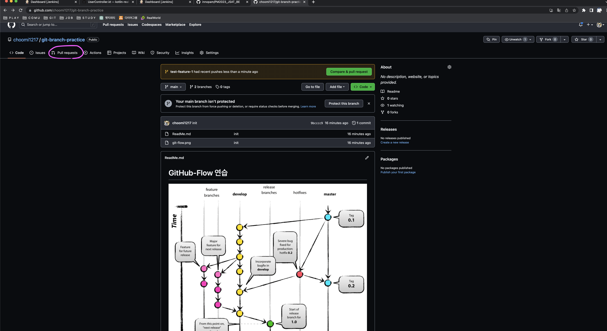
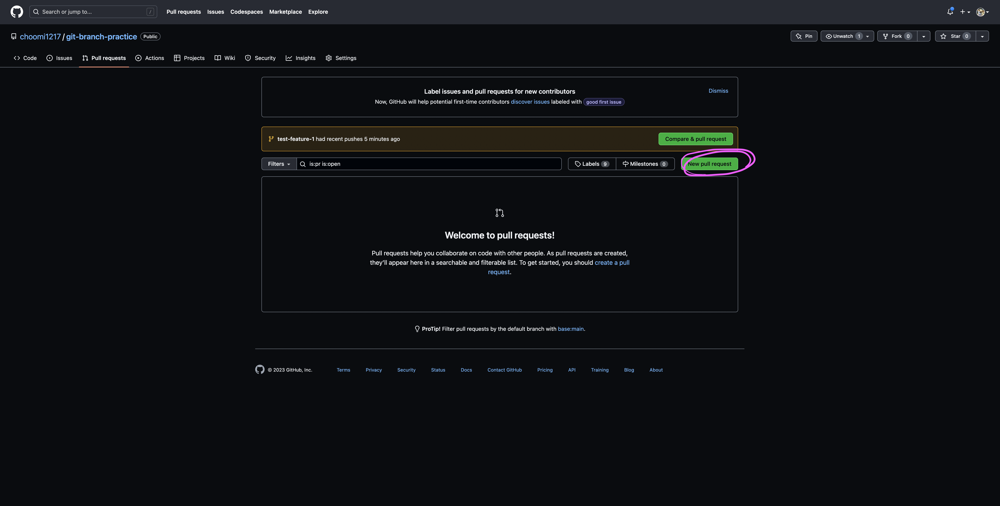
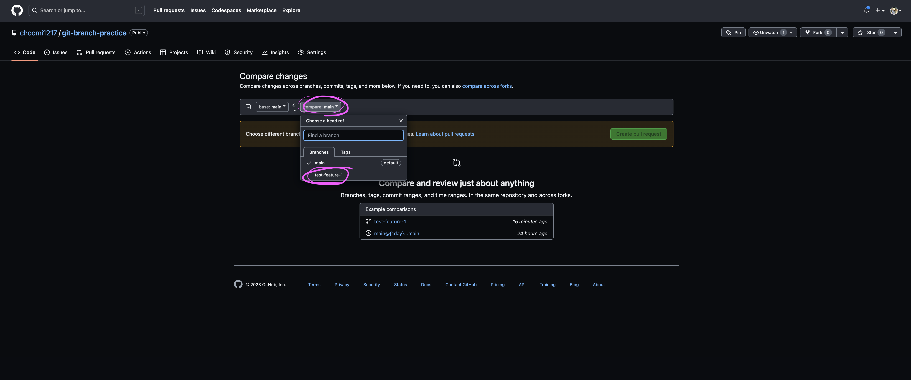
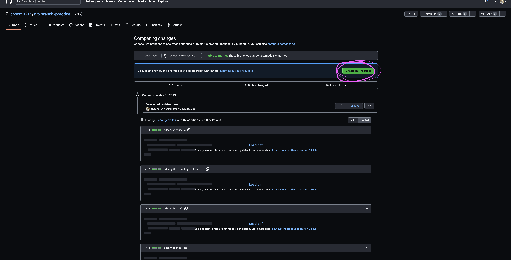
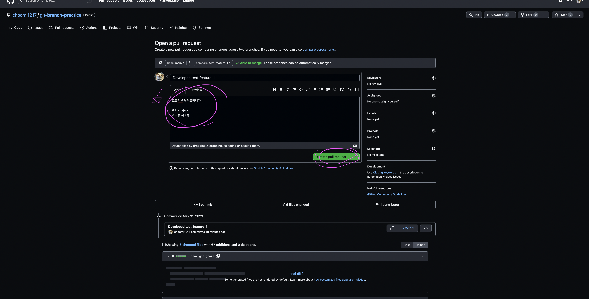
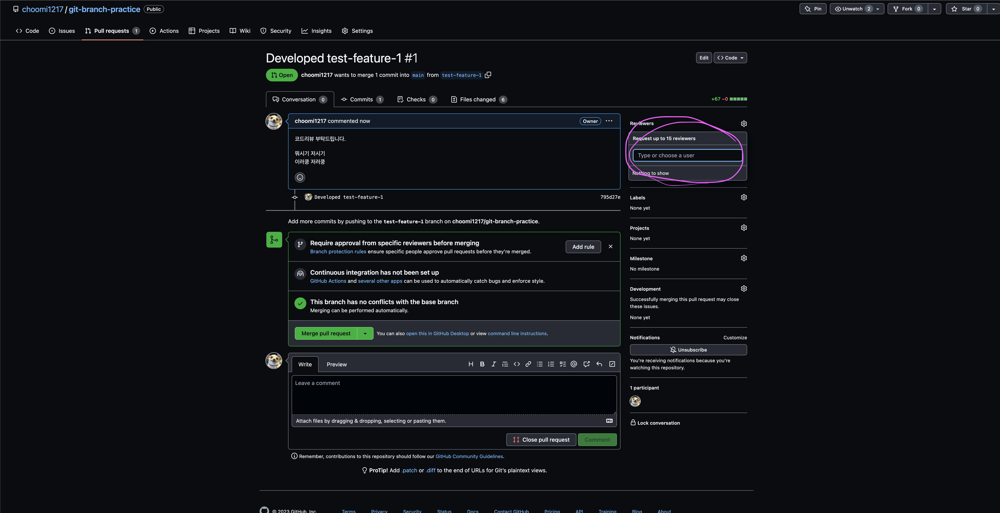
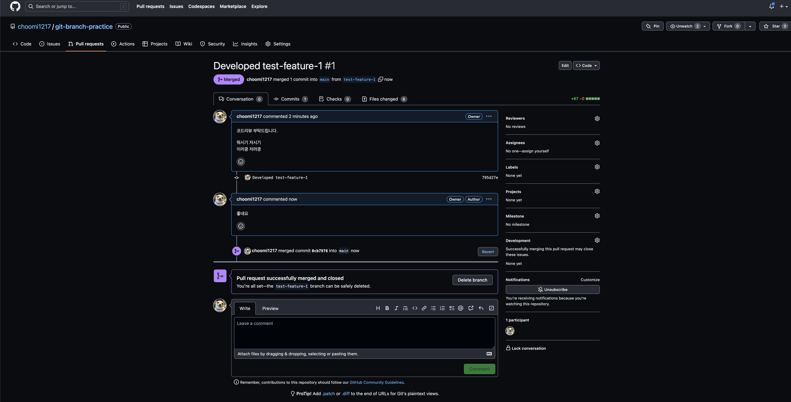

### Github-Flow 전략

1. master 브랜치는 어떤 때든 배포가 가능하다.
    - master 브랜치는 항상 최신 상태.
    - merge 하기 전에 충분한 테스트를 해야한다.
        - 꼭 브랜치를 push하고 Jenkins 를 이용해서 테스트를 한다.
2. 브랜치는 꼭 master에서 뻗어나온다.
3. 원격 브랜치로 수시로 push

[scott chacon의 github-flow](https://scottchacon.com/2011/08/31/github-flow.html)

### Github-Flow 전략을 위한 테스트 시나리오

1.  `test-feature-1` 이라는 이름으로 로컬에서 개발한다.
```git
git checkout -b test-feature-1
```
2. 작업한 내용 커밋 및 원격지에 푸시
   - 원격지에 master 로부터 나오는 브랜치 이름을 `test-feature-1`이라고 짓고 브랜치에 커밋한다.
```git
git add .
git commit -m "Developed test-feature-1"
git push origin test-feature-1
```
3. 코드 리뷰 요청
   - 팀원들에게 코드 리뷰를 받는다.
4. master 브랜치로 머지


### 코드리뷰 요청 방법





- 코멘트는 자세히 남기는 것이 좋음

- 코드 리뷰를 할 사람을 선택


### 머지 완료

