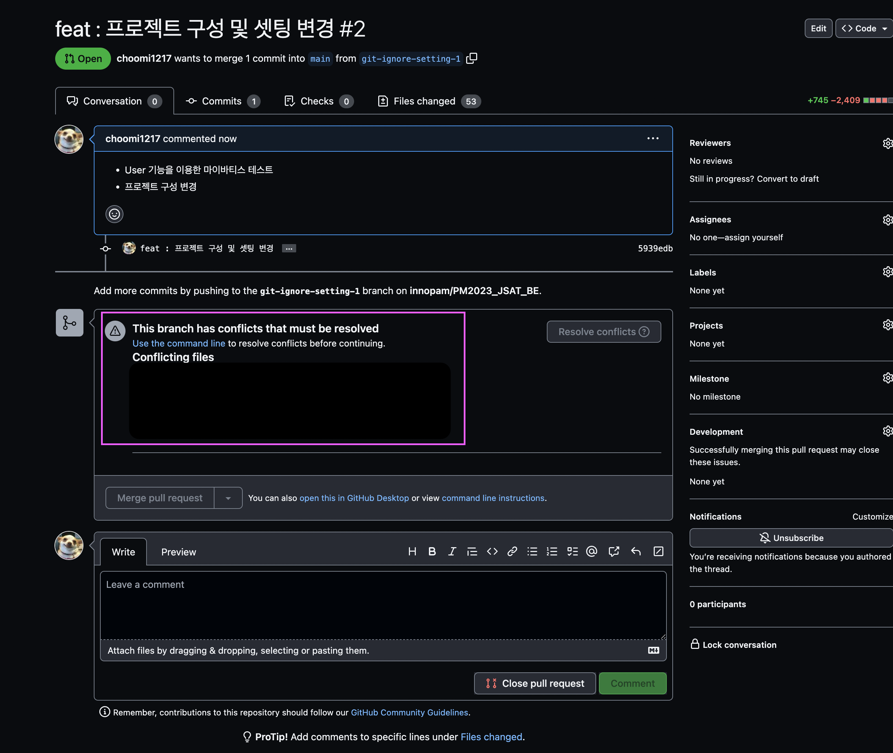
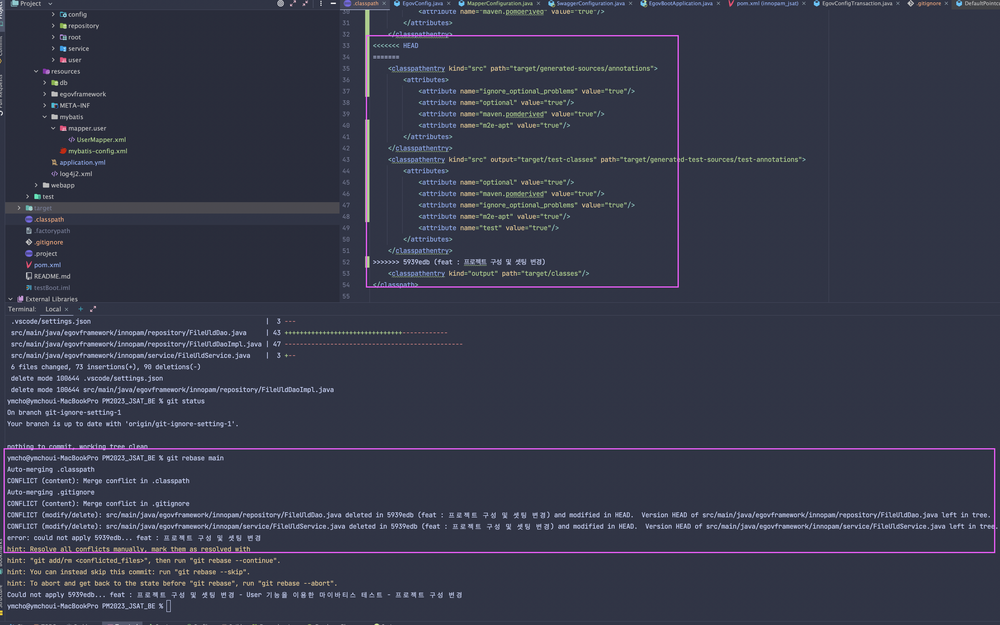
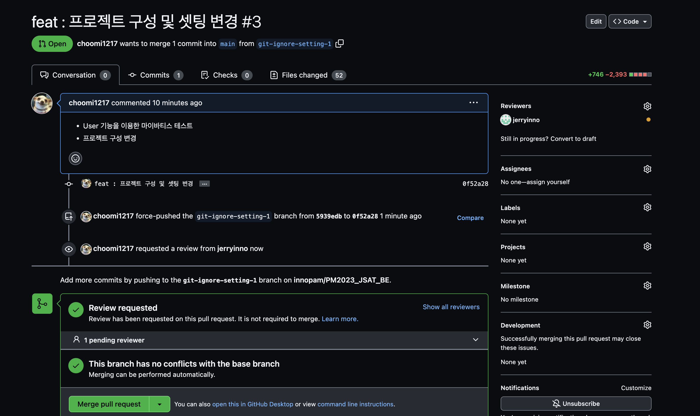

# 충돌 

`Can’t automatically merge. Don’t worry, you can still create the pull request.`

두 branch에서 같은 파일의 같은 부분을 다르게 수정했을 때 충돌(conflict)이 일어남

방법은 여러가지 있는데 내가 해결한 방법은 아래와 같다.

1. main 브랜치로 체크아웃
2. `git pull origin main`으로 원격 저장소 땡겨옴
3. 로컬에서 본인이 개발하면서 브랜치 만든 곳으로 다시 체크아웃 
3. `git rebase main` 으로 두개의 브랜치를 합치려고 시도하면 충돌난 파일이 나옴
4. 그 충돌한 파일을 열면 아래와 같은 그림으로 충돌된 부분을 표시해줌

5. 충돌난 부분을 손수 하나하나 해결해줌
6. `git add` 해줌
7. `git rebase --continue` 로 리베이스 마저 진행
8. `git push -f origin "your-branch"` 로 푸쉬

