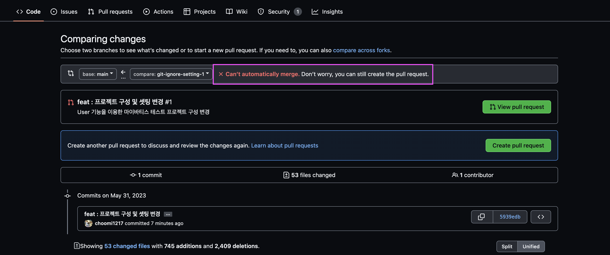

# 충돌 

`Can’t automatically merge. Don’t worry, you can still create the pull request.`

두 branch에서 같은 파일의 같은 부분을 다르게 수정했을 때 충돌(conflict)이 일어남

1. "Resolve conflicts" 버튼을 클릭합니다. (Github 웹사이트에서 이를 수행할 수 있습니다)
2. 충돌이 있는 파일들을 확인하고, 어떤 변경 사항을 유지할 것인지 선택합니다. 이 과정에서 필요하다면, 충돌을 일으킨 다른 개발자와 협의할 수도 있습니다.
3. 모든 충돌을 해결한 후, "Mark as resolved" 버튼을 클릭합니다.
4. 모든 파일에서 충돌을 해결했다면, "Commit merge" 버튼을 클릭합니다.

